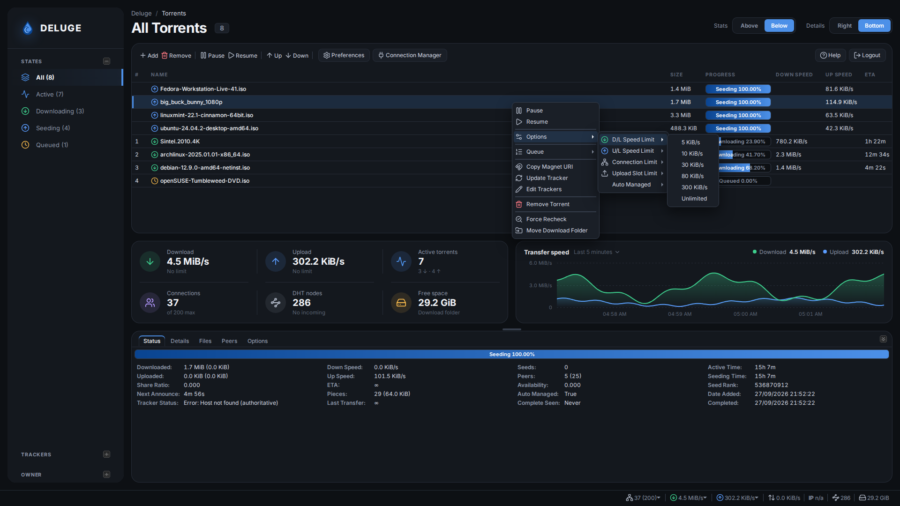
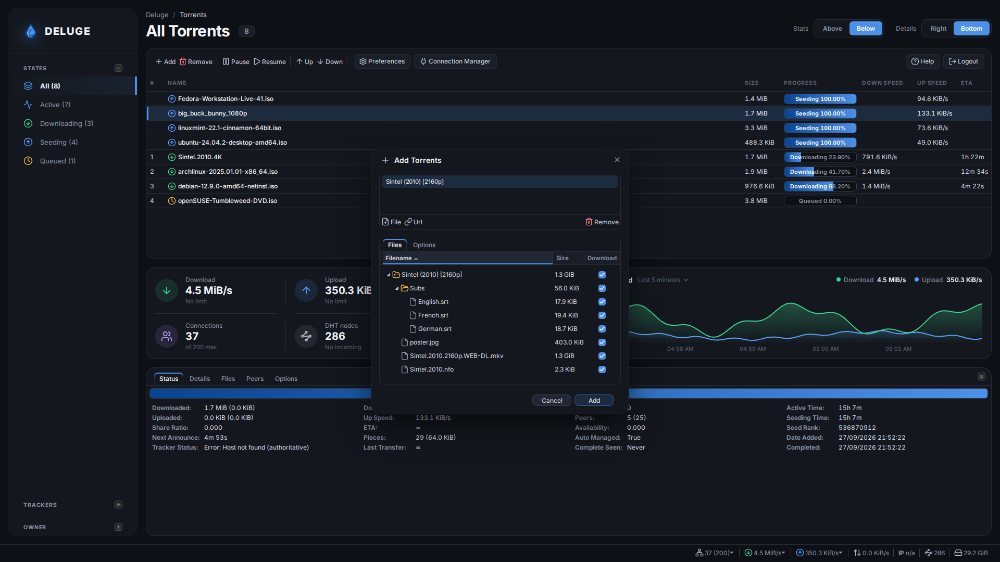
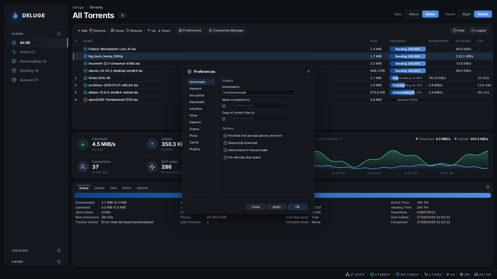
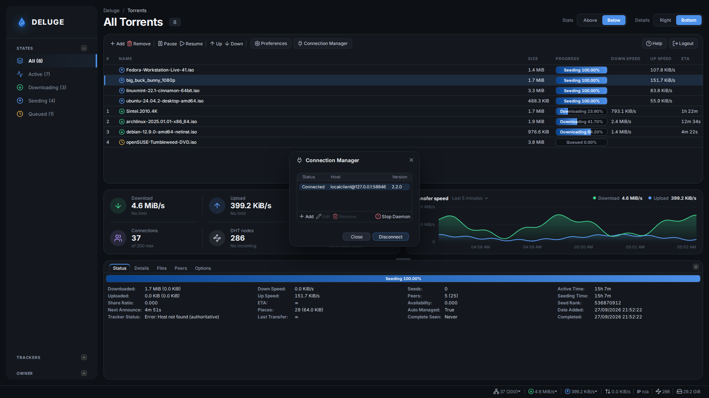

# Darkhand: a dashboard and dark theme for the Deluge Web UI

A modern dashboard layout and dark theme for the **Deluge 2.x Web UI**
(`deluge-web`), plus a script that installs and uninstalls them on Linux.

It comes in two parts:

- The **dashboard**, a Deluge plugin that rearranges the Web UI into floating
  cards with live stats and a speed chart.
- The **theme**, which gives Deluge the same dark look. It's what the
  dashboard is built on, and what you see with Deluge's standard layout if the
  plugin is disabled or you install the theme on its own.


## Dashboard

The dashboard rebuilds the Web UI from Deluge's own components: a navigation
card with the torrent filters, a page header, a live stats card, a transfer
speed chart, the torrent list, and the torrent details.

The stats card shows download and upload speed (with their limits), active
torrents (downloading and seeding), connections, DHT nodes (and whether incoming
connections work), and free space in the download folder. The values refresh
with Deluge's regular two-second update, so the card adds no extra requests.
If the daemon can't find the download folder (it doesn't exist, or the user
`deluged` runs as can't reach it), Free space says **Folder not found** with a
link to **Preferences → Downloads**, where Deluge's own status bar just says
"Error".

The speed chart plots download and upload over a range you pick: click the
range in its header ("Last 5 minutes") for the last 5 minutes, hour, 12 hours,
day or 30 days, or **Custom…** for any number of minutes, hours or days up to
90 days. Your choice is remembered in that browser. Deluge's web API keeps no
speed history, so the plugin's daemon side records one, every two seconds
whether or not a browser is open. It keeps less detail the further back it
goes, so 90 days take only a few hundred KB: every two seconds for the last
hour, a one-minute average for two days, a 15-minute average for 90 days. It
saves them to `darkhand_history.json` in Deluge's config folder every few
minutes and when the daemon stops, so the history survives a restart (the time
the daemon was down shows as a gap). The chart starts full when the page loads,
and time spent in a background tab (where browsers slow the page's updates)
fills in when you come back. It sits beside the stats when the column
is wide and below them when it's narrower. When the window is too short for the
chart without squeezing the torrent list, it's hidden until there's room again.

By default the stats and speed chart sit below the torrent list, with the
torrent details at the bottom, as above. Two switches in the header change
that, and your choices are remembered per browser:

- **Details: Right** moves the details card to the right.
- **Stats: Above** puts the stats and speed chart above the torrent list.

| Details on the right | Stats above the list |
| --- | --- |
|  |  |

Deluge's menus and windows match the cards: the torrent menu, Add Torrents,
Preferences and the Connection Manager, among others.

| Torrent menu | Add Torrents |
| --- | --- |
|  |  |
| **Preferences** | **Connection Manager** |
|  |  |

The transfer activity in the dashboard screenshots (speeds, progress, peers)
is simulated; the test setup they were taken on has no peers.

Also in the dashboard:

- The details card can be closed down to a slim strip and opened again from
  it. It stays open or closed as you left it, and remembers the size you drag
  it to. By default it takes about 30% of the window's height.
- The torrent list's columns always fit the card. Name takes the spare width
  (up to 1600px; very wide screens share the rest among the other columns),
  headers are never cut off, and when space is tight Name gets priority: the
  speed headers become **↓ Speed** and **↑ Speed** and the other columns give
  up a little width. Hovering the header row shows grab handles for resizing
  columns, and a width you set is kept. Owner is hidden by default; show it
  from any column's menu.
- Preferences, Connection Manager, Add Torrents and Deluge's other windows are
  styled as cards to match. The Connection Manager sizes its columns to fit,
  and when there's only one host it selects it for you, so connecting is a
  single click on **Connect**.
- Click the Deluge logo at the top of the navigation card for the About
  window.
- The Preferences, Connection Manager, Help and Logout buttons show their
  labels when the toolbar has room, and fold to round icon buttons when it
  doesn't.

Enabling the plugin reloads the page into the dashboard (after you close
Preferences, if you enabled it there). Disable it under **Preferences →
Plugins** and the standard layout, in the Darkhand theme, returns after a
page reload.

The dashboard has been tested on Deluge 2.2.

## Theme

The theme restyles Deluge's standard layout, and is what the Web UI falls back
to without the plugin:


- Flat, low-glare near-black palette with blue accents from the Deluge logo,
  and panels that float as rounded cards
- Bundled [Inter](https://rsms.me/inter/) and
  [JetBrains Mono](https://www.jetbrains.com/lp/mono/) fonts, served by
  `deluge-web` itself, so nothing is fetched from the internet. Latin, Cyrillic,
  Greek and Vietnamese torrent names all render in Inter. Hashes, peer
  addresses and paths use the monospace face, and numbers line up in columns
- [Lucide](https://lucide.dev) line icons replace Deluge's PNG icons in the
  toolbar, menus, sidebar, status bar and file list, colour-coded by torrent
  state (green downloading, blue seeding, amber queued, red error…)
- Recolours the whole UI: torrent list, sidebar, details tabs, dialogs, menus,
  tooltips, forms, progress bars and scrollbars
- Vector chevrons for combo and spinner buttons, and native dark checkboxes and
  scrollbars through `color-scheme: dark`
- Keeps the stock layout: rows, columns and dialogs are the same size as in the
  default theme, so nothing gets clipped
- Doesn't modify any Deluge file. The theme is one extra stylesheet that
  Deluge's own theme mechanism loads, plus a `themes/darkhand/` folder holding
  the fonts, icons and the dashboard's styles
- Works on Deluge 2.0, 2.1 and 2.2. On 2.2 and later it also appears under
  **Preferences → Interface → Theme**

## Install

```sh
git clone https://github.com/darkhand81/deluge_darkhand_theme.git
cd deluge_darkhand_theme
sudo ./darkhand.sh install
```

The script asks what to install:

1. **Theme + dashboard** (recommended, and the default): the dashboard plugin,
   with the theme set as the Web UI theme as its fallback. If you disable the
   plugin under **Preferences → Plugins**, the Web UI falls back to the theme
   with Deluge's standard layout.
2. **Theme only**: Deluge's standard layout in the Darkhand theme. If an
   earlier install added the dashboard plugin, it's removed.

Pass `--dashboard` or `--theme-only` to choose without the menu. With `-y`, or
when there's no terminal to ask on, it installs both.

Then reload the Web UI in your browser. Use Ctrl+Shift+R so the browser doesn't
serve the old stylesheet from its cache.

The script:

1. Finds the Deluge web UI directory (`…/site-packages/deluge/ui/web`). It uses
   the Python interpreter of a running `deluge-web`, the `deluge-web`/`deluged`
   launchers on your `PATH`, `python3`, and the usual system paths.
2. Copies `theme/xtheme-darkhand.css` into `…/deluge/ui/web/themes/css/`, and
   the fonts and icons in `theme/darkhand/` to `…/deluge/ui/web/themes/darkhand/`.
3. Finds every `web.conf` it can: the config dir of a running `deluge-web`,
   `~/.config/deluge`, the `deluge`/`debian-deluged` service users, `/config`
   for containers, and so on. It sets `"theme": "darkhand"` in each one and
   remembers the previous theme.
4. Stops any active `deluge-web` systemd unit before editing `web.conf`, then
   starts it again. `deluge-web` writes `web.conf` when it exits, so an edit
   made while it's running would be lost.
5. If you chose the dashboard, installs the plugin into the daemon's `plugins/` folder (next to
   `core.conf`) and enables it. It asks the running daemon to rescan and
   enable it over Deluge's local connection, using the `localclient` account
   from the daemon's `auth` file, so the daemon and your torrents keep
   running. `deluge-web` is restarted so it loads the plugin.

If the daemon runs on a different machine from `deluge-web`, the plugin must be
installed on both: run the script on each machine, or enable **Darkhand** under
**Preferences → Plugins** after copying the plugin egg into the daemon's
`plugins/` folder.

If `deluge-web` is running outside systemd (in `screen`, from a shell, and so
on), the script asks you to stop it first. You can also install only the file:

```sh
sudo ./darkhand.sh install --no-activate
```

On Deluge 2.2+, then choose **Darkhand** under **Preferences → Interface → Theme**.

### Windows and manual installs

`darkhand.sh` is for Linux. On Windows, or anywhere you'd rather not run it,
install from the [latest release](https://github.com/darkhand81/deluge_darkhand_theme/releases/latest),
which has the theme as `darkhand-theme-<version>.zip` and the dashboard plugin
as `Darkhand-<version>-py3.egg`:

1. Find Deluge's web UI `themes` folder. It's inside the Deluge install
   folder (on Windows, under `C:\Program Files\Deluge`), in `…\deluge\ui\web\themes`,
   and holds a `css` folder with Deluge's own `xtheme-gray.css`.
2. Extract the theme zip into that `themes` folder. It adds
   `css\xtheme-darkhand.css` and a `darkhand` folder. Writing under
   `Program Files` needs administrator rights.
3. In the Web UI, choose **Darkhand** under **Preferences → Interface →
   Theme** (Deluge 2.2 and later) and reload the page. On older versions,
   stop `deluge-web` and set `"theme": "darkhand"` in its `web.conf`
   (`%APPDATA%\deluge\web.conf` on Windows), then start it again.
4. For the dashboard, go to **Preferences → Plugins**, click **Install**,
   choose the egg, and tick **Darkhand** in the list. The page reloads into
   the dashboard once you close Preferences.

The dashboard needs the theme: it's where the dashboard's styles live. To
remove them, untick the plugin and delete its egg from the daemon's
`plugins` folder (`%APPDATA%\deluge\plugins` on Windows), choose another
theme, and delete the files the zip added. Upgrading Deluge removes the
theme (see below): extract the zip again afterwards.

## Uninstall

```sh
sudo ./darkhand.sh uninstall
```

This disables and removes the dashboard plugin, removes the stylesheet, and
restores the theme that was active before
installing (`gray` if none was recorded). If `web.conf` can't be edited because
`deluge-web` is running unmanaged, it's left alone. Once the stylesheet is gone,
Deluge falls back to its default theme on the next start anyway.

## Status

```sh
./darkhand.sh status
```

Shows the detected web UI directories and whether the theme is installed in
each, every `web.conf` with its active theme, whether the dashboard plugin is
installed and enabled for each daemon, and any running `deluge-web` units or
processes.

`install` and `uninstall` need root and exit with a hint to use `sudo` when run
as a regular user. `status` is read-only and runs without `sudo`, but it can't
see into other users' processes or config directories, so it may report less.

## Options

| Option | Description |
| --- | --- |
| `-w, --web-dir DIR` | Deluge web UI directory, if auto-detection misses it. Repeatable. |
| `-c, --config-dir DIR` | Directory containing `web.conf`. Repeatable. |
| `-p, --python PATH` | Python interpreter Deluge is installed under (venv, pipx…). |
| `--no-activate` | Only copy the stylesheet; leave `web.conf` alone. |
| `--no-restart` | Don't stop/start `deluge-web` systemd units. |
| `--dashboard` | Install the theme and the dashboard plugin without asking (the default with `-y`). |
| `--theme-only` | Install just the theme without asking; removes the dashboard plugin if installed. |
| `-y, --yes` | Don't prompt. |

Examples:

```sh
# Debian/Ubuntu "deluged" package layout
sudo ./darkhand.sh install -c /var/lib/deluged/config

# Deluge installed with pipx
sudo ./darkhand.sh install -p ~/.local/share/pipx/venvs/deluge/bin/python
```

### Docker

For containers such as `linuxserver/deluge`, copy the script, theme and plugin
into the container and run the installer there with the container's paths.
For just the theme, copying the stylesheet and the `darkhand` folder is
enough:

```sh
docker cp theme deluge:/tmp/darkhand-theme
docker exec deluge sh -c 'T="$(python3 -c "import deluge, os; print(os.path.dirname(deluge.__file__))")/ui/web/themes" &&
  cp /tmp/darkhand-theme/xtheme-darkhand.css "$T/css/" &&
  cp -R /tmp/darkhand-theme/darkhand "$T/"'
```

Then select the theme in Preferences, or set `"theme": "darkhand"` in
`/config/web.conf` while the container is stopped. The copy lives in the
container's filesystem, so recreating the container removes it. Repeat the
steps after pulling a new image.

## Upgrading Deluge

Package upgrades replace the `deluge/ui/web` directory, which removes the
stylesheet (and with it the dashboard's styles). Deluge then falls back to its
default theme. Run `sudo ./darkhand.sh install` again after upgrading.

## How it works

### Dashboard

A stylesheet can only restyle Deluge. It can't move panels, because Deluge's
ExtJS layout places them in JavaScript. The plugin's script runs just before
Deluge builds its window and arranges Deluge's own components (toolbar,
filters, torrent list, details tabs, status bar) differently, so everything
keeps working as before. The plugin itself is a small Python package in
`plugin/`, which the installer zips into a Deluge plugin egg; its script is
`plugin/deluge_darkhand/data/darkhand.js`. The dashboard's styles live in the
theme, in `theme/darkhand/dashboard.css`, and only apply while the plugin is
enabled.

### Theme

Deluge's Web UI is built on ExtJS 3, and Deluge loads one ExtJS "xtheme"
stylesheet from `deluge/ui/web/themes/css/xtheme-<name>.css`, chosen by the
`theme` key in `web.conf`. `xtheme-darkhand.css` imports the stock
`xtheme-gray.css`, which ships with every Deluge 2.x release and supplies the
structural sprites. The rest of the file repaints everything on top of it.

Deluge before 2.2 loads the theme *before* `deluge.css`. Selectors that compete
with `deluge.css` are prefixed with `html` so they win in either order.

`theme/darkhand/fonts.css` declares the bundled fonts, and
`theme/darkhand/icons.css` swaps in the SVG icons. The icons are inlined as data
URIs, so there are no extra requests. `icons.css` is generated by
`tools/build-icons.py` from the [`lucide-static`](https://www.npmjs.com/package/lucide-static)
package. To change an icon or its colour, edit the table in that script and
rebuild:

```sh
npm pack lucide-static && tar xzf lucide-static-*.tgz
python3 tools/build-icons.py package/icons
```

To customise the colours, edit the `--dh-*` custom properties at the top of
`theme/xtheme-darkhand.css` and re-run the installer.

For the design tokens, layout rules, and the Deluge and ExtJS quirks the
theme and dashboard work around, see the [style guide](docs/STYLE_GUIDE.md).

## Credits

- [Inter](https://github.com/rsms/inter) by The Inter Project Authors, SIL Open
  Font License 1.1
- [JetBrains Mono](https://github.com/JetBrains/JetBrainsMono) by The JetBrains
  Mono Project Authors, SIL Open Font License 1.1
- [Lucide](https://lucide.dev) icons, ISC License

The font licences are included next to the font files in
`theme/darkhand/fonts/`.
