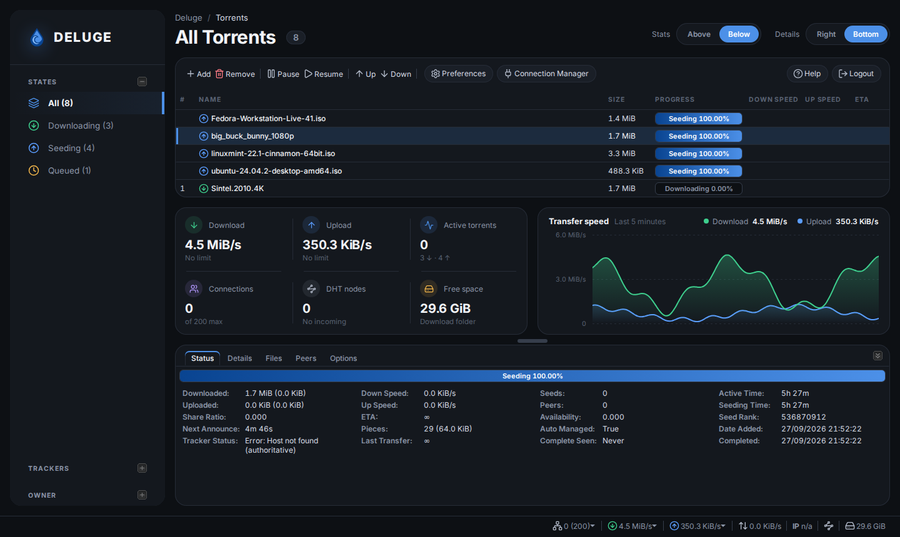
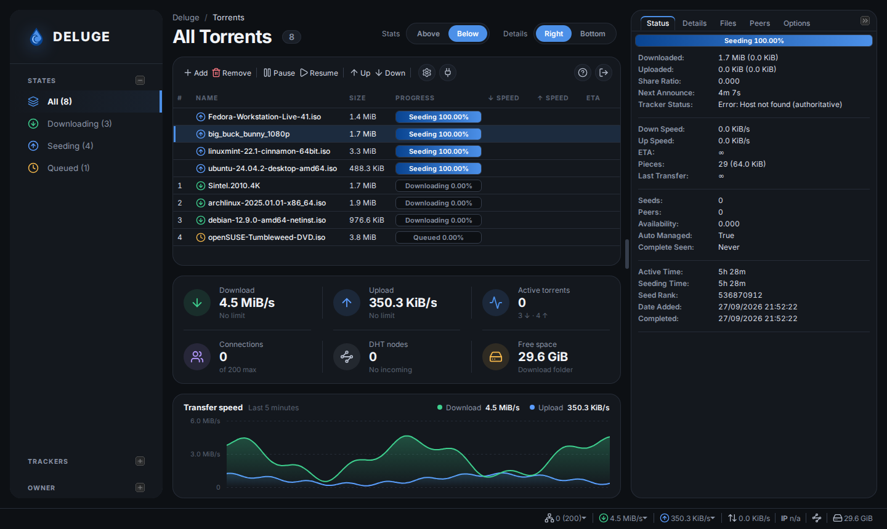
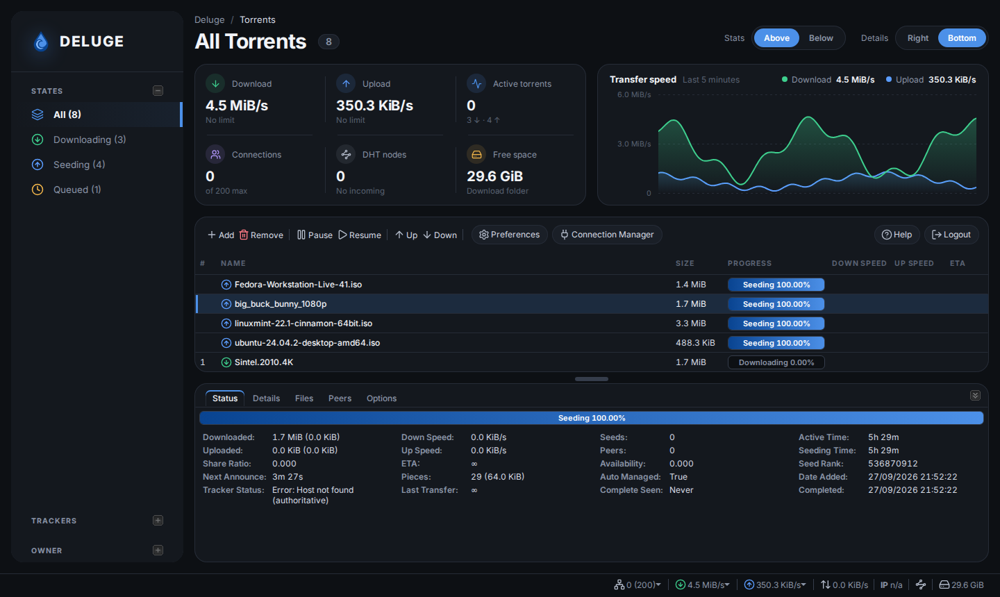

# Darkhand: a dark theme for the Deluge Web UI

A modern dark theme for the **Deluge 2.x Web UI** (`deluge-web`), plus a script
that installs and uninstalls it on Linux.


| Context menu | Preferences |
| --- | --- |
|  |  |

## Dashboard layout (experimental)

This branch adds an optional **Darkhand plugin** that rebuilds the Web UI as a
dashboard of floating cards: a navigation card with the torrent filters, a page
header, a live stats card, a transfer speed chart, the torrent list, and the
torrent details. Click the Deluge logo at the top of the navigation card for
the About window.

The stats card shows download and upload speed (with their limits), active
torrents (downloading and seeding), connections, DHT nodes (and whether incoming
connections work), and free space in the download folder. The values refresh
with Deluge's regular two-second update, so the card adds no extra requests.
If the daemon can't find the download folder (it doesn't exist, or the user
`deluged` runs as can't reach it), Free space says **Folder not found** with a
link to **Preferences → Downloads**, where Deluge's own status bar just says
"Error".

The speed chart plots download and upload over the last five minutes from the
same updates. Deluge's web API keeps no speed history, so the chart starts
filling when the page loads. It sits beside the stats when the column is wide
and below them when it's narrower. When the window is too short for the chart
without squeezing the torrent list, it's hidden until there's room again.

By default the stats and speed chart sit below the torrent list, with the
torrent details at the bottom:



Two switches in the header change that, and your choices are remembered per
browser:

- **Details: Right** moves the details card to the right.
- **Stats: Above** puts the stats and speed chart above the torrent list.

The details card can be closed down to a slim strip and opened again from
it; it stays open or closed as you left it, and remembers the size you drag
it to.

| Details on the right | Stats above the list |
| --- | --- |
|  |  |

The transfer speeds in the dashboard screenshots are simulated; the test
setup they were taken on has no peers.

A stylesheet can only restyle Deluge. It can't move panels, because Deluge's
ExtJS layout places them in JavaScript. The plugin's script runs just before
Deluge builds its window and arranges Deluge's own components (toolbar,
filters, torrent list, details tabs, status bar) differently, so everything
keeps working as before. The dashboard styles live in the theme and only apply
while the plugin is enabled. Disable the plugin under **Preferences → Plugins**
and the standard layout returns after a page reload.

## Features

- Flat, low-glare near-black palette with blue accents from the Deluge logo, and panels that
  float as rounded cards
- Bundled [Inter](https://rsms.me/inter/) and
  [JetBrains Mono](https://www.jetbrains.com/lp/mono/) fonts, served by
  `deluge-web` itself, so nothing is fetched from the internet. Latin, Cyrillic,
  Greek and Vietnamese torrent names all render in Inter. Hashes, peer
  addresses and paths use the monospace face, and numbers line up in columns
- [Lucide](https://lucide.dev) line icons replace Deluge's PNG icons in the
  toolbar, menus, sidebar, status bar and file list, colour-coded by torrent
  state (green downloading, blue seeding, amber queued, red error…)
- Recolours the whole UI: torrent list, sidebar, details tabs, dialogs, menus,
  tooltips, forms, progress bars and scrollbars
- Vector chevrons for combo and spinner buttons, and native dark checkboxes and
  scrollbars through `color-scheme: dark`
- Keeps the stock layout: rows, columns and dialogs are the same size as in the
  default theme, so nothing gets clipped
- Doesn't modify any Deluge file. The theme is one extra stylesheet that
  Deluge's own theme mechanism loads, plus a `themes/darkhand/` folder holding
  the fonts and icons
- Works on Deluge 2.0, 2.1 and 2.2. On 2.2 and later it also appears under
  **Preferences → Interface → Theme**

## Install

```sh
git clone https://github.com/darkhand81/deluge_darkhand_theme.git
cd deluge_darkhand_theme
sudo ./darkhand.sh install
```

The script asks what to install:

1. **Theme + dashboard** (recommended, and the default): the dashboard layout
   plugin, with the theme set as the Web UI theme. If you disable the plugin
   under **Preferences → Plugins**, the Web UI falls back to the theme with
   Deluge's standard layout.
2. **Theme only**: Deluge's standard layout in the Darkhand colours. If an
   earlier install added the dashboard plugin, it's removed.

Pass `--dashboard` or `--theme-only` to choose without the menu. With `-y`, or
when there's no terminal to ask on, it installs both.

Then reload the Web UI in your browser. Use Ctrl+Shift+R so the browser doesn't
serve the old stylesheet from its cache.

The script:

1. Finds the Deluge web UI directory (`…/site-packages/deluge/ui/web`). It uses
   the Python interpreter of a running `deluge-web`, the `deluge-web`/`deluged`
   launchers on your `PATH`, `python3`, and the usual system paths.
2. Copies `theme/xtheme-darkhand.css` into `…/deluge/ui/web/themes/css/`, and
   the fonts and icons in `theme/darkhand/` to `…/deluge/ui/web/themes/darkhand/`.
3. Finds every `web.conf` it can: the config dir of a running `deluge-web`,
   `~/.config/deluge`, the `deluge`/`debian-deluged` service users, `/config`
   for containers, and so on. It sets `"theme": "darkhand"` in each one and
   remembers the previous theme.
4. Stops any active `deluge-web` systemd unit before editing `web.conf`, then
   starts it again. `deluge-web` writes `web.conf` when it exits, so an edit
   made while it's running would be lost.
5. If you chose the dashboard, installs the plugin into the daemon's `plugins/` folder (next to
   `core.conf`) and enables it. It asks the running daemon to rescan and
   enable it over Deluge's local connection, using the `localclient` account
   from the daemon's `auth` file, so the daemon and your torrents keep
   running. `deluge-web` is restarted so it loads the plugin.

If the daemon runs on a different machine from `deluge-web`, the plugin must be
installed on both: run the script on each machine, or enable **Darkhand** under
**Preferences → Plugins** after copying the plugin egg into the daemon's
`plugins/` folder.

If `deluge-web` is running outside systemd (in `screen`, from a shell, and so
on), the script asks you to stop it first. You can also install only the file:

```sh
sudo ./darkhand.sh install --no-activate
```

On Deluge 2.2+, then choose **Darkhand** under **Preferences → Interface → Theme**.

## Uninstall

```sh
sudo ./darkhand.sh uninstall
```

This disables and removes the dashboard plugin, removes the stylesheet, and
restores the theme that was active before
installing (`gray` if none was recorded). If `web.conf` can't be edited because
`deluge-web` is running unmanaged, it's left alone. Once the stylesheet is gone,
Deluge falls back to its default theme on the next start anyway.

## Status

```sh
./darkhand.sh status
```

Shows the detected web UI directories and whether the theme is installed in
each, every `web.conf` with its active theme, and any running `deluge-web`
units or processes.

`install` and `uninstall` need root and exit with a hint to use `sudo` when run
as a regular user. `status` is read-only and runs without `sudo`, but it can't
see into other users' processes or config directories, so it may report less.

## Options

| Option | Description |
| --- | --- |
| `-w, --web-dir DIR` | Deluge web UI directory, if auto-detection misses it. Repeatable. |
| `-c, --config-dir DIR` | Directory containing `web.conf`. Repeatable. |
| `-p, --python PATH` | Python interpreter Deluge is installed under (venv, pipx…). |
| `--no-activate` | Only copy the stylesheet; leave `web.conf` alone. |
| `--no-restart` | Don't stop/start `deluge-web` systemd units. |
| `--dashboard` | Install the theme and the dashboard plugin without asking (the default with `-y`). |
| `--theme-only` | Install just the theme without asking; removes the dashboard plugin if installed. `--no-plugin` is an alias. |
| `-y, --yes` | Don't prompt. |

Examples:

```sh
# Debian/Ubuntu "deluged" package layout
sudo ./darkhand.sh install -c /var/lib/deluged/config

# Deluge installed with pipx
sudo ./darkhand.sh install -p ~/.local/share/pipx/venvs/deluge/bin/python
```

### Docker

For containers such as `linuxserver/deluge`, copy the script and theme into the
container and point it at the container's paths, or just copy the stylesheet
and the `darkhand` folder:

```sh
docker cp theme deluge:/tmp/darkhand-theme
docker exec deluge sh -c 'T="$(python3 -c "import deluge, os; print(os.path.dirname(deluge.__file__))")/ui/web/themes" &&
  cp /tmp/darkhand-theme/xtheme-darkhand.css "$T/css/" &&
  cp -R /tmp/darkhand-theme/darkhand "$T/"'
```

Then select the theme in Preferences, or set `"theme": "darkhand"` in
`/config/web.conf` while the container is stopped. The copy lives in the
container's filesystem, so recreating the container removes it. Repeat the
steps after pulling a new image.

## Upgrading Deluge

Package upgrades replace the `deluge/ui/web` directory, which removes the
stylesheet. Deluge then falls back to its default theme. Run
`sudo ./darkhand.sh install` again after upgrading.

## How it works

Deluge's Web UI is built on ExtJS 3, and Deluge loads one ExtJS "xtheme"
stylesheet from `deluge/ui/web/themes/css/xtheme-<name>.css`, chosen by the
`theme` key in `web.conf`. `xtheme-darkhand.css` imports the stock
`xtheme-gray.css`, which ships with every Deluge 2.x release and supplies the
structural sprites. The rest of the file repaints everything on top of it.

Deluge before 2.2 loads the theme *before* `deluge.css`. Selectors that compete
with `deluge.css` are prefixed with `html` so they win in either order.

`theme/darkhand/fonts.css` declares the bundled fonts, and
`theme/darkhand/icons.css` swaps in the SVG icons. The icons are inlined as data
URIs, so there are no extra requests. `icons.css` is generated by
`tools/build-icons.py` from the [`lucide-static`](https://www.npmjs.com/package/lucide-static)
package. To change an icon or its colour, edit the table in that script and
rebuild:

```sh
npm pack lucide-static && tar xzf lucide-static-*.tgz
python3 tools/build-icons.py package/icons
```

To customise the colours, edit the `--dh-*` custom properties at the top of
`theme/xtheme-darkhand.css` and re-run the installer.

## Credits

- [Inter](https://github.com/rsms/inter) by The Inter Project Authors, SIL Open
  Font License 1.1
- [JetBrains Mono](https://github.com/JetBrains/JetBrainsMono) by The JetBrains
  Mono Project Authors, SIL Open Font License 1.1
- [Lucide](https://lucide.dev) icons, ISC License

The font licences are included next to the font files in
`theme/darkhand/fonts/`.
