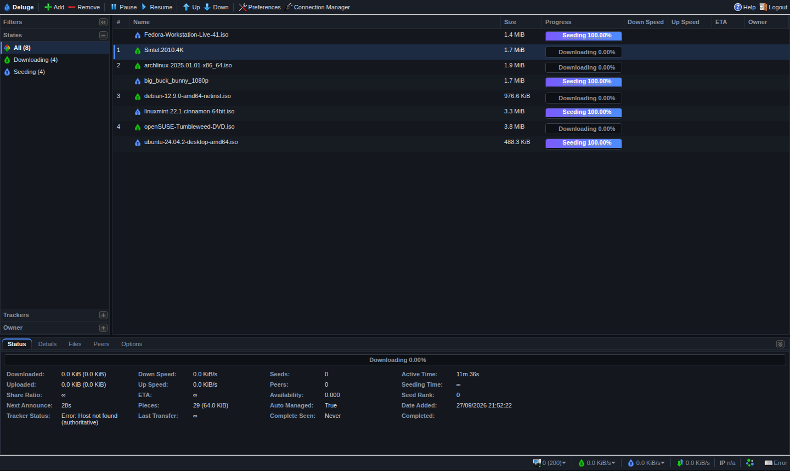
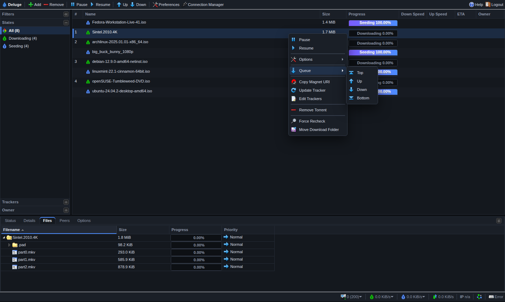
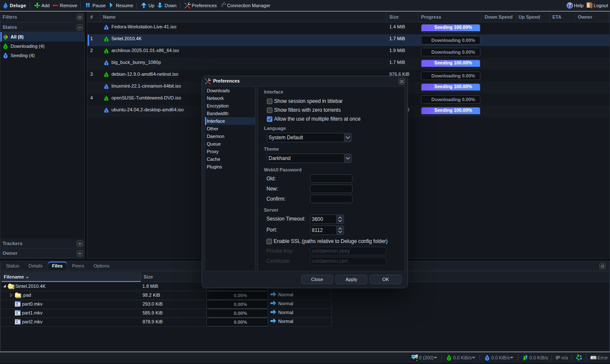

# Darkhand: a dark theme for the Deluge Web UI

A modern dark theme for the **Deluge 2.x Web UI** (`deluge-web`), plus a script
that installs and uninstalls it on Linux.



| Context menu | Preferences |
| --- | --- |
|  |  |

## Features

- Flat, low-glare slate palette with one blue accent
- Recolours the whole UI: torrent list, sidebar, details tabs, dialogs, menus,
  tooltips, forms, progress bars and scrollbars
- Vector chevrons for combo and spinner buttons, and native dark checkboxes and
  scrollbars through `color-scheme: dark`
- Keeps the stock layout: rows, columns and dialogs are the same size as in the
  default theme, so nothing gets clipped
- Doesn't modify any Deluge file. The theme is one extra stylesheet that
  Deluge's own theme mechanism loads
- Works on Deluge 2.0, 2.1 and 2.2. On 2.2 and later it also appears under
  **Preferences → Interface → Theme**

## Install

```sh
git clone https://github.com/darkhand81/deluge_darkhand_theme.git
cd deluge_darkhand_theme
sudo ./darkhand.sh install
```

Then reload the Web UI in your browser. Use Ctrl+Shift+R so the browser doesn't
serve the old stylesheet from its cache.

The script:

1. Finds the Deluge web UI directory (`…/site-packages/deluge/ui/web`). It uses
   the Python interpreter of a running `deluge-web`, the `deluge-web`/`deluged`
   launchers on your `PATH`, `python3`, and the usual system paths.
2. Copies `theme/xtheme-darkhand.css` into `…/deluge/ui/web/themes/css/`.
3. Finds every `web.conf` it can: the config dir of a running `deluge-web`,
   `~/.config/deluge`, the `deluge`/`debian-deluged` service users, `/config`
   for containers, and so on. It sets `"theme": "darkhand"` in each one and
   remembers the previous theme.
4. Stops any active `deluge-web` systemd unit before editing `web.conf`, then
   starts it again. `deluge-web` writes `web.conf` when it exits, so an edit
   made while it's running would be lost.

If `deluge-web` is running outside systemd (in `screen`, from a shell, and so
on), the script asks you to stop it first. You can also install only the file:

```sh
sudo ./darkhand.sh install --no-activate
```

On Deluge 2.2+, then choose **Darkhand** under **Preferences → Interface → Theme**.

## Uninstall

```sh
sudo ./darkhand.sh uninstall
```

This removes the stylesheet and restores the theme that was active before
installing (`gray` if none was recorded). If `web.conf` can't be edited because
`deluge-web` is running unmanaged, it's left alone. Once the stylesheet is gone,
Deluge falls back to its default theme on the next start anyway.

## Status

```sh
./darkhand.sh status
```

Shows the detected web UI directories and whether the theme is installed in
each, every `web.conf` with its active theme, and any running `deluge-web`
units or processes.

## Options

| Option | Description |
| --- | --- |
| `-w, --web-dir DIR` | Deluge web UI directory, if auto-detection misses it. Repeatable. |
| `-c, --config-dir DIR` | Directory containing `web.conf`. Repeatable. |
| `-p, --python PATH` | Python interpreter Deluge is installed under (venv, pipx…). |
| `--no-activate` | Only copy the stylesheet; leave `web.conf` alone. |
| `--no-restart` | Don't stop/start `deluge-web` systemd units. |
| `-y, --yes` | Don't prompt. |

Examples:

```sh
# Debian/Ubuntu "deluged" package layout
sudo ./darkhand.sh install -c /var/lib/deluged/config

# Deluge installed with pipx
./darkhand.sh install -p ~/.local/share/pipx/venvs/deluge/bin/python
```

### Docker

For containers such as `linuxserver/deluge`, copy the script and theme into the
container and point it at the container's paths, or just copy the stylesheet:

```sh
docker cp theme/xtheme-darkhand.css deluge:/tmp/
docker exec deluge sh -c 'cp /tmp/xtheme-darkhand.css \
  "$(python3 -c "import deluge, os; print(os.path.dirname(deluge.__file__))")/ui/web/themes/css/"'
```

Then select the theme in Preferences, or set `"theme": "darkhand"` in
`/config/web.conf` while the container is stopped. The copy lives in the
container's filesystem, so recreating the container removes it. Repeat the
steps after pulling a new image.

## Upgrading Deluge

Package upgrades replace the `deluge/ui/web` directory, which removes the
stylesheet. Deluge then falls back to its default theme. Run
`sudo ./darkhand.sh install` again after upgrading.

## How it works

Deluge's Web UI is built on ExtJS 3, and Deluge loads one ExtJS "xtheme"
stylesheet from `deluge/ui/web/themes/css/xtheme-<name>.css`, chosen by the
`theme` key in `web.conf`. `xtheme-darkhand.css` imports the stock
`xtheme-gray.css`, which ships with every Deluge 2.x release and supplies the
structural sprites. The rest of the file repaints everything on top of it.

Deluge before 2.2 loads the theme *before* `deluge.css`. Selectors that compete
with `deluge.css` are prefixed with `html` so they win in either order.

To customise the colours, edit the `--dh-*` custom properties at the top of
`theme/xtheme-darkhand.css` and re-run the installer.
